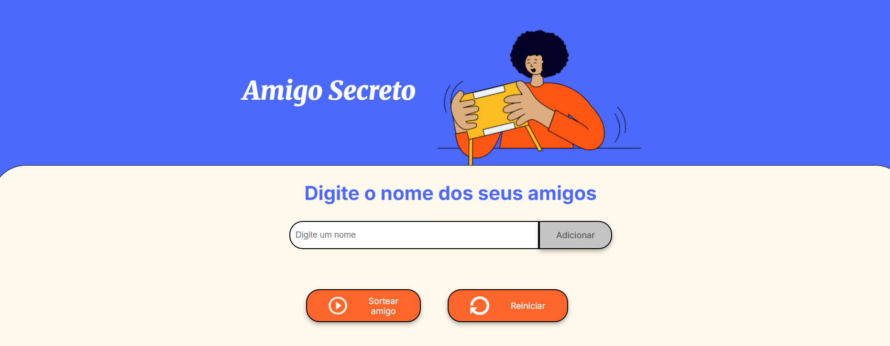

<h1 align="center"> Jogo do Amigo Secreto </h1>

# Introdução
---
O jogo do amigo secreto é um jogo que permite a inclusão de vários nomes de amigos para um sorteio.

* Dica:
  Caso queira jogá-lo imediatamente, basta apenas acessar: [Link do jogo](https://challenge-lilac-alpha.vercel.app)

# Instalação:
---
  Não é necessário qualquer instalação, basta apenas acessar o link acima.

# Guia de contribuição:
---
Qualquer melhoria e correções serão bem vindas, entre em contato.

# Contato:
---

# Contribuidores:
---

# Agradecimentos Especiais:
---

